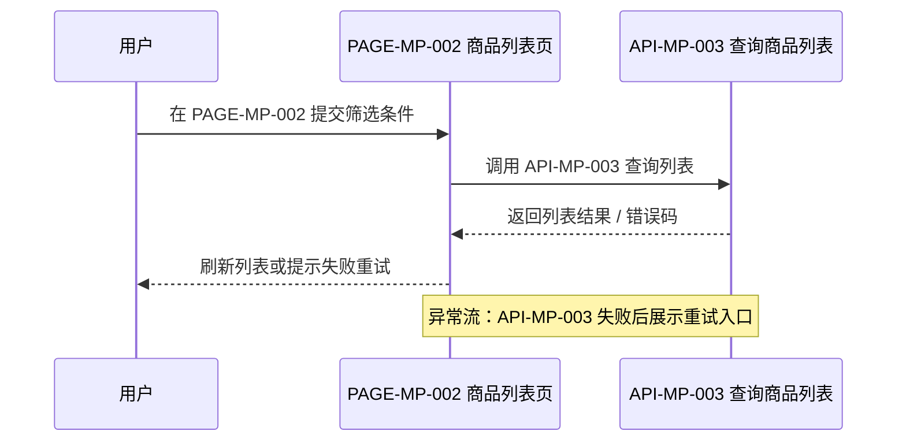

# LNY-PRD — 李宁远产品工作流

AI Agent Skills 驱动的产品需求文档（PRD）工作流工具包。以"文档先行、原型后置"为原则，将产品需求从立项到迭代的全生命周期拆分为 **八步标准化流程**，由 AI Agent 按技能边界各司其职、逐步推进。适用于 Cursor、Claude Code、Codex 等支持 Agent Skills 的 AI 编程工具。

## 一、八步工作流

| 步骤 | 命令 | 职责 |
|------|------|------|
| ① | `/lny-prd-master` | 总控入口与立项，生成项目骨架（`main_spec.md` 等） |
| ② | `/lny-prd-ui` | 页面架构与 UI 清单（`ui_manifest.md` + `ui/` 明细） |
| ③ | `/lny-prd-api` | 接口需求（`api_spec.md` + `api/API-*.md`） |
| ④ | `/lny-prd-feature` | 功能规格拆分（`feature_spec.md` + `feature/FEATURE-*.md`） |
| ⑤ | `/lny-prd-page` | 单页 PRD 生成（`versions/{v}/pages_prd/`） |
| ⑥ | `/lny-prd-prototype` | 可交互原型（`prototypes/`，桌面端基于 Material UI） |
| ⑦ | `/lny-prd-check` | 文档一致性检查 + 功能性验收（只读报告） |
| ⑧ | `/lny-prd-iter` | 新迭代管理（建版本壳 + 变更台账 + 委派清单） |

**②③④** 为规格三件套，可并行推进；**⑤→⑥** 文档先行，互不硬阻塞。

## 二、核心原则

- **只读检查**：⑦ `/lny-prd-check` 不改任何文件，仅输出报告与委派建议
- **版本纪律**：仅 ① 可建 `v1.0.0`，仅 ⑧ 可建新版本并追加变更记录
- **技能边界**：每一步都有明确的"负责"与"禁止"清单，Agent 不得越权
- **框架内置排除**：公司统一框架已有能力（登录、支付、RBAC 等）默认不写入 PRD，避免重复展开

## 三、能力边界

### 3.1 本工具包能做什么（✅）

| 领域 | 说明 |
|------|------|
| **需求结构化** | 将模糊的产品想法转化为分层、有索引、可追溯的文档体系（主规格 → 页面 → 接口 → 功能） |
| **UI 规划** | 梳理页面清单、分包结构、组件层级，产出可落盘为 `ui/` 明细的 UI 设计规格 |
| **接口需求定义** | 按终端拆解 API 需求（含第三方），产出带请求/响应语义的接口明细文档 |
| **功能拆分** | 将整体需求拆为独立的功能模块，每个功能有目标、流程、验收标准 |
| **单页 PRD** | 面向具体页面的回归式需求文档，强制写明依赖路径与数据来源 |
| **可交互原型** | 基于 Material UI 生成桌面端可点击原型、移动端静态 HTML 原型，支持页面导航与关系画布 |
| **文档检查** | 对已有 PRD 做只读一致性校验（引用闭环、编号规范、统计对齐），输出审计报告 |
| **迭代管理** | 创建新版本目录骨架、变更台账（ui/api/feature），标注委派清单 |

**一句话**：本工具包覆盖从"我想做这个东西"到"需求文档 & 原型都写好了，拿去给开发看吧"的**全量产品规划阶段**。

### 3.2 本工具包不能做什么（❌）

| 领域 | 说明 |
|------|------|
| **不写生产代码** | 不生成后端 API 实现、数据库 DDL、业务逻辑、中间件配置等 |
| **不输出前端应用** | 原型是静态展示品，不是可上线的前端项目；没有路由、状态管理、接口联调等 |
| **不管理部署** | 不涉及 CI/CD、容器化、域名、服务器、发布流程 |
| **不写测试** | 验收标准是自然语言描述，不是可执行的自动化测试用例 |
| **不做技术选型** | 不定框架版本、不选数据库、不设计缓存策略——那是开发侧的事 |
| **不做项目管理** | 没有甘特图、工时估算、人员排期；迭代台账只是记录层面的轻量留痕 |

**一句话**：本工具包的产物停在了"PRD + 可交互原型"这一层——它是给开发者看懂需求用的，**不是给终端用户用的成品软件**。

### 3.3 个人独立开发者须知：与编程技能包组合使用

如果你是**个人独立开发者**，想用 AI 从零到一完成一个完整的可上线项目，光靠本工具包是不够的。本工具包解决的是"**产品规划怎么做**"的问题，而"**代码怎么写**"需要另一类技能包来承接。

推荐组合方式：

| 阶段 | 使用的技能包 | 产出 |
|------|-------------|------|
| **产品规划** | `lny-prd-*`（本工具包） | PRD 文档 + 原型 |
| **技术实现** | Superpower、或其他 AI 编程指导类技能包 | 工程代码、前后端应用、部署配置 |
| **质量保障** | `lny-prd-check`（可交叉校验） + 代码审查类技能包 | 需求与实现的一致性核验 |

**典型流程**：

```text
lny-prd-*（立项 → 规格 → 原型）
        ↓  产物交付
Superpower 等编程技能包（需求理解 → 技术方案 → 逐模块编码 → 联调 → 上线）
        ↓  交叉校验
lny-prd-check（回归检查需求是否遗漏或偏离）
```

> Superpower 等技能包擅长根据需求描述（尤其是本工具包生成的 `main_spec`、`feature/`、`api/` 等结构化文档）快速生成技术方案和工程代码，补齐本工具包不覆盖的编码与部署环节。

## 四、前置条件

- 支持 Agent Skills 的 AI 编程工具（Cursor、Claude Code、Codex 等）
- 已将本仓库各 `lny-prd-*/` 目录下的 `SKILL.md` 注册为 Agent Skill

## 五、快速开始

### 5.1 安装

将本仓库克隆到本地，并在 AI 编程工具中将各子目录注册为 Agent Skill（具体方式取决于所用工具）：

**Cursor**：将 `lny-prd-*/` 目录放入 `~/.cursor/skills/` 或在工作区 `.cursor/skills/` 中引用。

**Claude Code / Codex**：按对应工具的 Skill 配置方式，指向各 `lny-prd-*/SKILL.md` 文件。

### 5.2 使用

在 AI 编程工具中打开任意空目录（或已有 `main_spec.md` 的 PRD 项目根目录），输入总控命令：

```
@lny-prd-master
```

或直接使用斜杠命令：

```
/lny-prd-master
```

Agent 将自动判定当前状态：

- **空目录**：进入立项对话，引导你描述项目背景和需求（如项目名称、产品定位、目标用户、终端范围等），以自然语言对话式沟通收集完整立项要素，确认后生成初始文档
- **已有项目**：按状态检测找到当前应执行的步骤，自动路由；回复「继续」即可进入下一轮

### 5.3 推荐工作流

```text
① 立项 → ②③④ 规格三件套（并行） → ⑤ 单页 PRD → ⑥ 原型生成 → ⑦ 检查验收 → ⑧ 新迭代（重复）
```

每轮只需输入「继续」，Agent 自动推进下一步，无需用户手动选择子指令。

## 六、产物结构

完整的 PRD 项目生成后，目录结构如下：

```
my-project/                         # PRD 项目根目录
│
├── main_spec.md                    # 产品规格说明书（概述、终端、统计索引）
├── api_spec.md                     # 接口需求索引（§4 终端对齐 + API/EXT 清单）
├── ui_manifest.md                  # UI 设计清单（页面/分包/组件索引）
├── feature_spec.md                 # 功能规格索引（全局规则 + Feature 索引）
│
├── api/                            # 接口需求明细（③ 负责）
│   ├── API-MP-001.md               #   小程序接口
│   ├── API-AD-001.md               #   管理后台接口
│   └── EXT-001.md                  #   第三方接口
│
├── ui/                             # UI 页面与组件明细（② 负责）
│   ├── PAGE-MP-001.md              #   单页面布局与状态描述
│   ├── PAGE-AD-001.md
│   └── COMP-001.md                 #   局部自定义 UI 组件规格
│
├── feature/                        # 功能规格明细（④ 负责）
│   ├── FEATURE-001.md              #   单功能：目标、流程、验收标准、双图
│   └── FEATURE-002.md
│
├── prototypes/                     # 可交互原型（⑥ 负责）
│   ├── MP/                         #   小程序端
│   │   ├── index.html              #     页面导航汇总
│   │   ├── map.html                #     页面关系画布
│   │   └── PAGE-MP-001.html        #     单页原型
│   ├── AD/                         #   管理后台端
│   └── PC/                         #   PC 端
│
├── prototypes-mui-app/             # 桌面端 React + Material UI 源码（⑥ 负责）
│
└── versions/                       # 版本管理（① 立项 / ⑧ 迭代）
    ├── v1.0.0/                     #   首版
    │   ├── iteration_notes.md      #     过程性留痕
    │   ├── pages_prd/              #     单页 PRD（⑤ 负责）
    │   │   └── PAGE-MP-001.md
    │   └── prototypes/             #     原型静态镜像
    └── v1.1.0/                     #   次版（⑧ 创建）
        ├── iteration_notes.md
        ├── ui_changes.md           #     变更台账
        ├── api_changes.md
        └── feature_changes.md
```

## 七、产物示例

以下摘取四种核心产物的典型片段，展示实际落盘格式。

#### 7.1 API 需求明细（`api/API-MP-001.md`）— 请求 & 响应参数字段表

##### 请求需求

| 业务字段 | 类型语义 | 必要 | 说明 |
|----------|----------|:--:|------|
| 商品名称 | 字符串 | 否 | 模糊搜索 |
| 分类 | 字符串（枚举） | 否 | 单选的枚举值；从分类下拉接口取值 |
| 价格区间 | 字符串 | 否 | "min,max" 格式，单位元 |
| 当前页码 | 数值 | 是 | 从 1 起 |
| 每页条数 | 数值 | 是 | 与列表页 UI 一致 |

##### 响应需求

| 业务字段 | 类型语义 | 必要 | 说明 |
|----------|----------|:--:|------|
| 商品列表 | 数组（元素为对象） | 是 | 每项含：商品 ID、名称、图片、价格、库存状态 |
| 总条数 | 数值 | 是 | 用于分页组件计算总页数 |

#### 7.2 UI 页面线框（`ui/PAGE-MP-001.md` / 单页 PRD 第 3 节）— ASCII 线框图

```text
┌────────────────────────────┐
│  顶栏：页面标题 + 返回按钮 │
├────────────────────────────┤
│  搜索区                    │
│  ┌──────────────────────┐  │
│  │ 搜索框 + 筛选按钮    │  │
│  └──────────────────────┘  │
├────────────────────────────┤
│  分类 Tab（全部 | 食品 |    │
│  日用品 | 数码）           │
├────────────────────────────┤
│  商品列表（瀑布流）        │
│  ┌──────┐ ┌──────┐        │
│  │ 卡片  │ │ 卡片  │  …   │
│  └──────┘ └──────┘        │
│  ┌──────┐ ┌──────┐        │
│  │ 卡片  │ │ 卡片  │  …   │
│  └──────┘ └──────┘        │
├────────────────────────────┤
│  底：分页 / 加载更多       │
└────────────────────────────┘
```

#### 7.3 Feature 功能时序图（`feature/FEATURE-001.md`）— Mermaid 泳道时序图



#### 7.4 迭代台账（`versions/v1.1.0/ui_changes.md`）— 变更表与委派顺序

**变更台账**（`ui_changes.md`）：

| ID | 操作 | 摘要 | 委派步 | pages_prd目标路径 | 状态 |
|----|------|------|--------|-------------------|------|
| PAGE-MP-004 | 新增 | 商品详情页 | ② | versions/v1.1.0/pages_prd/pages/goods/PAGE-MP-004.md | 待② |
| PAGE-MP-001 | 修改 | 首页新增推荐模块 | ② | versions/v1.1.0/pages_prd/pages/index/PAGE-MP-001.md | 待② |
| PAGE-MP-003 | 废弃 | 旧版搜索页下线 | ② | 无需单页 PRD | 待② |

**委派顺序**（`iteration_notes.md`）：

1. `/lny-prd-ui`（②）— 新增 PAGE-MP-004；修改 PAGE-MP-001；废弃 PAGE-MP-003
2. `/lny-prd-api`（③）— 新增 API-MP-010；修改 API-MP-002
3. `/lny-prd-feature`（④）— 新增 FEATURE-010；修改 FEATURE-003
4. `/lny-prd-page`（⑤）— `pages_prd/pages/goods/PAGE-MP-004.md`、`pages_prd/pages/index/PAGE-MP-001.md`
5. `/lny-prd-prototype`（⑥）— 有新增/修改页面，必做
6. `/lny-prd-check`（⑦）— 建议

## 八、工具包结构

```
lny-prd-master/                     # 本仓库（工具包，非 PRD 项目）
├── lny-prd-api/SKILL.md            # ③ 接口需求规范
├── lny-prd-check/SKILL.md          # ⑦ 检查与验收
├── lny-prd-feature/SKILL.md        # ④ 功能规格拆分
├── lny-prd-iter/SKILL.md           # ⑧ 迭代管理
├── lny-prd-master/SKILL.md         # ① 总控入口与立项
├── lny-prd-page/SKILL.md           # ⑤ 单页 PRD
├── lny-prd-prototype/SKILL.md      # ⑥ 可交互原型
├── lny-prd-ui/SKILL.md             # ② UI 设计
├── README.md
└── .gitignore
```

## 九、许可证

MIT License
