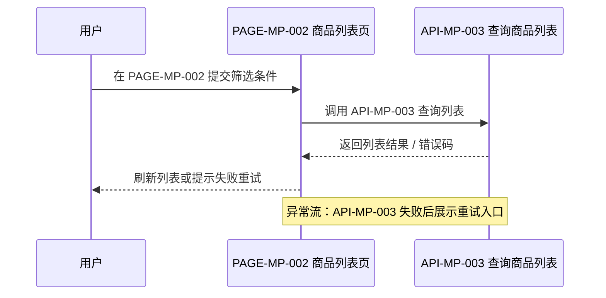

# LNY-PRD — 李宁远产品工作流

AI Agent Skills 驱动的产品需求文档（PRD）工作流工具包。以"文档先行、原型后置"为原则，将产品需求从立项到迭代的全生命周期拆分为 **九步标准化流程**，由 AI Agent 按技能边界各司其职、逐步推进。适用于 Cursor、Claude Code、Codex 等支持 Agent Skills 的 AI 编程工具。

## 一、九步工作流

| 步骤 | 命令 | 职责 |
|------|------|------|
| ① | `/lny-prd-master` | 总控入口与立项，生成项目骨架（`main_spec.md` 等） |
| ② | `/lny-prd-ui` | 页面架构与 UI 清单（`ui_manifest.md` + `ui/` 明细） |
| ③ | `/lny-prd-api` | 接口需求（`api_spec.md` + `api/API-*.md`） |
| ④ | `/lny-prd-feature` | 功能规格拆分（`feature_spec.md` + `feature/FEATURE-*.md`） |
| ⑤ | `/lny-prd-page` | 单页 PRD 生成（`versions/{v}/pages_prd/`） |
| ⑥ | `/lny-prd-prototype` | 可交互原型（`prototypes/`，桌面端基于 Material UI） |
| ⑦ | `/lny-prd-check` | 文档一致性检查 + 功能性验收 + 产品就绪度检查（只读报告） |
| ⑧ | `/lny-prd-iter` | 新迭代管理（建版本壳 + 变更台账 + 委派清单） |
| ⑨ | `/lny-prd-sp` | 按指定版本汇总 FE/BE 故事点（`sp_report.md`） |

**②③④** 为规格三件套，可并行推进（总控 **同轮批跑**，中间不问「继续」）；**⑥ 默认依赖 ⑤**（`pages_prd`；例外标注 `ui直出`）；**⑨** 建议在信号齐且产品链可估后执行。

## 二、核心原则

- **文档先行、原型后置**：先产出结构化需求文档（`main_spec`、`api/`、`ui/`、`feature/`），再据此生成可交互原型，确保原型是需求的可视化验证而非空中楼阁
- **技能边界**：每一步都有明确的"负责"与"禁止"清单，Agent 不得越权；**Skill 只写干啥，原理说明书集中在本 README**
- **版本纪律**：仅 ① 可建 `v1.0.0`，仅 ⑧ 可建新版本并追加变更记录
- **只读检查**：⑦ `/lny-prd-check` 不改任何文件，仅输出报告与委派建议
- **框架内置排除**：公司统一框架已有能力（登录、支付、RBAC 等）默认不写入 PRD，避免重复展开
- **阶段 1 采信号、阶段 2 算 SP**：规格采齐估点信号；**⑨ `/lny-prd-sp`** 按版本套公式出分

## 2.1 可评估性（说明书）

> 各 `lny-prd-*/SKILL.md` **只**规定字段与禁项；本节说明 **为什么** 以及信号落在哪。

### 边界

| 项 | 约定 |
|----|------|
| 阶段 1 | 信号可采集 + check 可检查；**不算 SP** |
| 阶段 2 | **`/lny-prd-sp`** 按版本套公式打分 → `versions/{v}/sp_report.md` |
| PRD 永不写 | DDL、真实表名、HTTP/path/JSON/响应 code |
| 校准层 | FE 细视觉看设计稿；BE 表结构细活看实现/Superpower —— **均不进** FE 三维因子 / BE 四维枚举 |

### 产品可评估链（阻塞「不可估」）

`STORY → FEATURE → AC → PAGE → API`

缺任一关键环 → check **三、产品就绪度** 判不可估。FE/BE 信号缺 → 只标「角色估点信号不全」，**不**因此把产品打成不可估。

### FE 三维信号（落点）

> **FE 三维**（非 AD，一页一行）：① 页面定位 · ② 页面体验 · ③ 页面数据。与 BE 维号独立。角色基线：`主流程` 2.0 / `支线` 1.0 / `辅助`·`设置` 0.5。体验档（交互/视觉）各档相对旧 1～4 **整体 -1** → `0`/`1`/`2`/`3`。编排：并行 `0.5` / 串行 `1.5` / 混合 `2.0`。

| 维 | 因子 | 手填/采集事实源 |
|:--:|------|------------------|
| ① 页面定位 | 角色基线 | 非 AD 的 PAGE + `pages_prd` §7 流程角色 |
| ① | 功能数量 | **单页** 关联 FEATURE 个数 → `少量`/`一般`/`较多`/`极多` |
| ② 页面体验 | 交互体验 | **单页** `ui/PAGE` + manifest：`简单` / `标准` / `较复杂` / `极复杂` |
| ② | 视觉细节 | **单页** `ui/PAGE` + manifest：`粗糙` / `标准` / `精致` / `极精致` |
| ③ 页面数据 | API数量 | **单页** `pages_prd` §5/§7 → `少量`/`一般`/`较多`/`极多` |
| ③ | 请求编排 | **单页** `pages_prd` §7：`单请求或并行` / `串行` / `串并行混合` |

### BE 四维信号（落点）

> **BE 维号独立于 FE**（①～④）。**不采持久化档**。  
> **① AD页面规模** = 仅 AD 页（骨架 + D5 + 本页 API 档，权重见 [`lny-prd-sp`](lny-prd-sp/SKILL.md)）。  
> **② 自有API** = 按 API 计行：API基线（服务对象）+ 数据操作形态 + 第三方联动 + 特殊通道。  
> **③ EXT对接**、**④ FEATURE规则** 各自独立。读写由形态覆盖；第三方「是」须挂 `EXT-*`；特殊通道覆盖 WebSocket/SSE 等。

| 维 | 名称 | 落盘 |
|:--:|------|------|
| ① | AD页面规模 | **按页**：`ui/PAGE` **骨架码** + **`D5弹窗数`**（清单一致）+ `pages_prd` **本页API条数**（§7=§5；0～4→+0；5～6→+0.5；7～9→+1.0；≥10→+1.5）；D5 档见 sp 权重 |
| ② | 自有API | 每条 `API-*`：服务对象；数据操作形态（含多对象普通/复杂）；第三方联动；特殊通道 |
| ③ | EXT对接 | **独立**：`EXT-*` + **交互方向** / **业务敏感度** / **联调门槛**（见 sp 权重） |
| ④ | FEATURE规则 | **独立**：FEATURE：**分支数** + AC 表行数 |

> **页数**：FE 按 **非 AD 页**估；BE ① = 仅 AD（页侧规模，非「页数×0.5」）。

表结构 ≈ 前端的设计稿：PRD 只采产品代理信号，细活实现后校准。

### 迭代估点信号（相对上一版）

首版能力信号不够估「改一版」的工时。迭代另采两列 + 一页汇总（**不计点**）：

| 信号 | 落盘 | 枚举 |
|------|------|------|
| **变更形态** | 三类 `*_changes.md` 每行 | `新建` / `复制扩展` / `修改` / `废弃删除` |
| **存量数据影响** | 同上 | `无` / `需迁移` / `需备份或回滚预案` |
| **汇总** | `versions/{v}/eval_signals.md` | 形态/存量计数 + 存量≠无关注列表 |

缺 → check 标「迭代估点信号不全」，不阻塞产品可估。禁止在清单写 DDL。

### 阶段 2：按版本故事点（`/lny-prd-sp`）

- **必指定版本**（或取 `versions/` 最大版本并写进报告抬头）。
- **计分范围**：无台账变更行 → **全量** active 规格；有台账 → **仅本版变更**并乘迭代系数。
- **产出**：`versions/{v}/sp_report.md`（FE_SP / BE_SP / 合计）；产品链不可估则停算；**同版本重跑直接覆盖**原报告。
- **权重表**：以 [`lny-prd-sp/SKILL.md`](lny-prd-sp/SKILL.md) 为准（可后校准）。摘要：

| 侧 | 要点 |
|----|------|
| FE | **三维**（非 AD）：①页面定位（角色基线+功能数量）· ②页面体验（交互+视觉）· ③页面数据（API数量+编排）；主流程 2.0；编排串行 1.5/混合 2.0；体验维持 |
| BE | ①～④ 分对象：① AD页面规模 · ② 自有API（单侧基线 0.5 / 双侧 1）· ③ EXT对接（联调含「文档未知需研发调研」=5）· ④ FEATURE规则 |

| 迭代 | 形态：新建 1 / 复制扩展 0.4 / 修改 0.6 / 废弃 0.5；存量：无 1 / 迁移 1.3 / 备份回滚 1.2（连乘） |

样例直觉：主流程下单（高分支、多对象写入、可能含支付 EXT）≫ 独立反馈页（低分支、简单写入）。

### 交付消费（简图）

```text
BE：main_spec 自上而下 + feature/api → Superpower（不以 pages_prd 为主入口）
FE：① ui 页壳 → ② api 全局层 → ③ 可复用 COMP → ④ 多 Agent 各读 pages_prd 装配
原型：默认 pages_prd；例外标注 ui直出
```

### check / sp

- **⑦ check**：**一文档性** | **二功能性** | **三产品就绪度**（含 FE 三维、BE 四维与迭代信号）—— 第三项 **不计点**
- **⑨ sp**：读齐的信号 → 按版本出 `sp_report.md`

## 三、能力边界

### 3.1 本工具包能做什么（✅）

| 领域 | 说明 |
|------|------|
| **需求结构化** | 将模糊的产品想法转化为分层、有索引、可追溯的文档体系（主规格 → 页面 → 接口 → 功能） |
| **UI 规划** | 梳理页面清单、分包结构、组件层级，产出可落盘为 `ui/` 明细的 UI 设计规格 |
| **接口需求定义** | 按终端拆解 API 需求（含第三方），产出带请求/响应语义的接口明细文档 |
| **功能拆分** | 将整体需求拆为独立的功能模块，每个功能有目标、流程、验收标准 |
| **单页 PRD** | 面向具体页面的回归式需求文档，强制写明依赖路径与数据来源 |
| **可交互原型** | 基于 Material UI 生成桌面端可点击原型、移动端静态 HTML 原型，支持页面导航与关系画布 |
| **文档检查** | 对已有 PRD 做只读一致性校验（引用闭环、编号规范、统计对齐），输出审计报告 |
| **迭代管理** | 创建新版本目录骨架、变更台账（ui/api/feature），标注委派清单 |
| **版本故事点** | 按版本汇总 FE/BE（及迭代系数）SP，落盘 `sp_report.md` |

**一句话**：本工具包覆盖从"我想做这个东西"到"需求文档 & 原型都写好了，拿去给开发看吧"的**全量产品规划阶段**。

### 3.2 本工具包不能做什么（❌）

| 领域 | 说明 |
|------|------|
| **不写生产代码** | 不生成后端 API 实现、数据库 DDL、业务逻辑、中间件配置等 |
| **不输出前端应用** | 原型是静态展示品，不是可上线的前端项目；没有路由、状态管理、接口联调等 |
| **不管理部署** | 不涉及 CI/CD、容器化、域名、服务器、发布流程 |
| **不写测试** | 验收标准是自然语言描述，不是可执行的自动化测试用例 |
| **不做技术选型** | 不定框架版本、不选数据库、不设计缓存策略——那是开发侧的事 |
| **不做项目管理** | 没有甘特图、人员排期；**⑨** 只给版本级故事点汇总，不做人天排期 |

**一句话**：本工具包的产物停在了"PRD + 可交互原型"这一层——它是给开发者看懂需求用的，**不是给终端用户用的成品软件**。

### 3.3 个人独立开发者须知：与编程技能包组合使用

如果你是**个人独立开发者**，想用 AI 从零到一完成一个完整的可上线项目，光靠本工具包是不够的。本工具包解决的是"**产品规划怎么做**"的问题，而"**代码怎么写**"需要另一类技能包来承接。

推荐组合方式：

| 阶段 | 使用的技能包 | 产出 |
|------|-------------|------|
| **产品规划** | `lny-prd-*`（本工具包） | PRD 文档 + 原型 |
| **技术实现** | Superpower、或其他 AI 编程指导类技能包 | 工程代码、前后端应用、部署配置 |
| **质量保障** | `lny-prd-check`（可交叉校验） + 代码审查类技能包 | 需求与实现的一致性核验 |

**典型流程**：

```text
lny-prd-*（立项 → 规格 → 原型）
        ↓  产物交付
Superpower 等编程技能包（需求理解 → 技术方案 → 逐模块编码 → 联调 → 上线）
        ↓  交叉校验
lny-prd-check（回归检查需求是否遗漏或偏离）
```

> Superpower 等技能包擅长根据需求描述（尤其是本工具包生成的 `main_spec`、`feature/`、`api/` 等结构化文档）快速生成技术方案和工程代码，补齐本工具包不覆盖的编码与部署环节。

## 四、前置条件

- 支持 Agent Skills 的 AI 编程工具（Cursor、Claude Code、Codex 等）
- 已将本仓库各 `lny-prd-*/` 目录下的 `SKILL.md` 注册为 Agent Skill

## 五、快速开始

### 5.1 安装

将本仓库克隆到本地，并在 AI 编程工具中将各子目录注册为 Agent Skill（具体方式取决于所用工具）：

**Cursor**：将 `lny-prd-*/` 目录放入 `~/.cursor/skills/` 或在工作区 `.cursor/skills/` 中引用。

**Claude Code / Codex**：按对应工具的 Skill 配置方式，指向各 `lny-prd-*/SKILL.md` 文件。

### 5.2 使用

在 AI 编程工具中打开任意空目录（或已有 `main_spec.md` 的 PRD 项目根目录），输入总控命令：

```
@lny-prd-master
```

或直接使用斜杠命令：

```
/lny-prd-master
```

Agent 将自动判定当前状态：

- **空目录**：进入立项对话，引导你描述项目背景和需求（如项目名称、产品定位、目标用户、终端范围等），以自然语言对话式沟通收集完整立项要素，确认后生成初始文档
- **已有项目**：按状态检测找到当前应执行的步骤，自动路由；回复「继续」即可进入下一轮

### 5.3 推荐工作流

```text
① 立项 → ②③④ 规格三件套（并行） → ⑤ 单页 PRD → ⑥ 原型生成 → ⑦ 检查验收 → ⑨ 估点 → ⑧ 新迭代（重复）
```

每轮只需输入「继续」，Agent 自动推进下一步；**②③④** 会在同一轮连续完成，无需三次确认。

## 六、产物结构

完整的 PRD 项目生成后，目录结构如下：

```
my-project/                         # PRD 项目根目录
│
├── main_spec.md                    # 产品规格说明书（概述、终端、统计索引）
├── api_spec.md                     # 接口需求索引（§4 终端对齐 + API/EXT 清单）
├── ui_manifest.md                  # UI 设计清单（页面/分包/组件索引）
├── feature_spec.md                 # 功能规格索引（全局规则 + Feature 索引）
│
├── api/                            # 接口需求明细（③ 负责）
│   ├── API-MP-001.md               #   小程序接口
│   ├── API-AD-001.md               #   管理后台接口
│   └── EXT-001.md                  #   第三方接口
│
├── ui/                             # UI 页面与组件明细（② 负责）
│   ├── PAGE-MP-001.md              #   单页面布局与状态描述
│   ├── PAGE-AD-001.md
│   └── COMP-001.md                 #   局部自定义 UI 组件规格
│
├── feature/                        # 功能规格明细（④ 负责）
│   ├── FEATURE-001.md              #   单功能：目标、流程、验收标准、双图
│   └── FEATURE-002.md
│
├── prototypes/                     # 可交互原型（⑥ 负责）
│   ├── MP/                         #   小程序端
│   │   ├── index.html              #     页面导航汇总
│   │   ├── map.html                #     页面关系画布
│   │   └── PAGE-MP-001.html        #     单页原型
│   ├── AD/                         #   管理后台端
│   └── PC/                         #   PC 端
│
├── prototypes-mui-app/             # 桌面端 React + Material UI 源码（⑥ 负责）
│
└── versions/                       # 版本管理（① 立项 / ⑧ 迭代）
    ├── v1.0.0/                     #   首版
    │   ├── iteration_notes.md      #     过程性留痕
    │   ├── pages_prd/              #     单页 PRD（⑤ 负责）
    │   │   └── PAGE-MP-001.md
    │   └── prototypes/             #     原型静态镜像
    └── v1.1.0/                     #   次版（⑧ 创建）
        ├── iteration_notes.md
        ├── eval_signals.md         #     迭代估点信号汇总（不计点）
        ├── sp_report.md            #     版本故事点（⑨ 负责）
        ├── ui_changes.md           #     变更台账
        ├── api_changes.md
        └── feature_changes.md
```

## 七、产物示例

以下摘取五种核心产物的典型片段，展示实际落盘格式。

#### 7.1 API 需求明细（`api/API-MP-001.md`）— 请求 & 响应参数字段表

##### 请求需求

| 业务字段 | 类型语义 | 必要 | 说明 |
|----------|----------|:--:|------|
| 商品名称 | 字符串 | 否 | 模糊搜索 |
| 分类 | 字符串（枚举） | 否 | 单选的枚举值；从分类下拉接口取值 |
| 价格区间 | 字符串 | 否 | "min,max" 格式，单位元 |
| 当前页码 | 数值 | 是 | 从 1 起 |
| 每页条数 | 数值 | 是 | 与列表页 UI 一致 |

##### 响应需求

| 业务字段 | 类型语义 | 必要 | 说明 |
|----------|----------|:--:|------|
| 商品列表 | 数组（元素为对象） | 是 | 每项含：商品 ID、名称、图片、价格、库存状态 |
| 总条数 | 数值 | 是 | 用于分页组件计算总页数 |

#### 7.2 UI 页面线框（`ui/PAGE-MP-001.md` / 单页 PRD 第 3 节）— ASCII 线框图

```text
┌────────────────────────────┐
│  顶栏：页面标题 + 返回按钮 │
├────────────────────────────┤
│  搜索区                    │
│  ┌──────────────────────┐  │
│  │ 搜索框 + 筛选按钮    │  │
│  └──────────────────────┘  │
├────────────────────────────┤
│  分类 Tab（全部 | 食品 |    │
│  日用品 | 数码）           │
├────────────────────────────┤
│  商品列表（瀑布流）        │
│  ┌──────┐ ┌──────┐        │
│  │ 卡片  │ │ 卡片  │  …   │
│  └──────┘ └──────┘        │
│  ┌──────┐ ┌──────┐        │
│  │ 卡片  │ │ 卡片  │  …   │
│  └──────┘ └──────┘        │
├────────────────────────────┤
│  底：分页 / 加载更多       │
└────────────────────────────┘
```

#### 7.3 Feature 功能时序图（`feature/FEATURE-001.md`）— Mermaid 泳道时序图


```mermaid
sequenceDiagram
    participant User as 用户
    participant UI_MP_002 as PAGE-MP-002 商品列表页
    participant API_MP_003 as API-MP-003 查询商品列表
    User->>UI_MP_002: 在 PAGE-MP-002 提交筛选条件
    UI_MP_002->>API_MP_003: 调用 API-MP-003 查询列表
    API_MP_003-->>UI_MP_002: 返回列表结果 / 错误码
    UI_MP_002-->>User: 刷新列表或提示失败重试
    Note over UI_MP_002,API_MP_003: 异常流：API-MP-003 失败后展示重试入口
```

#### 7.4 迭代台账（`versions/v1.1.0/ui_changes.md`）— 变更表与委派顺序

**变更台账**（`ui_changes.md`）：

| ID | 操作 | 变更形态 | 存量数据影响 | 摘要 | 委派步 | pages_prd目标路径 | 状态 |
|----|------|----------|--------------|------|--------|-------------------|------|
| PAGE-MP-004 | 新增 | 新建 | 无 | 商品详情页 | ② | versions/v1.1.0/pages_prd/pages/goods/PAGE-MP-004.md | 待② |
| PAGE-MP-001 | 修改 | 修改 | 无 | 首页新增推荐模块 | ② | versions/v1.1.0/pages_prd/pages/index/PAGE-MP-001.md | 待② |
| PAGE-MP-003 | 废弃 | 废弃删除 | 需备份或回滚预案 | 旧版搜索页下线 | ② | 无需单页 PRD | 待② |

**委派顺序**（`iteration_notes.md`）：

1. `/lny-prd-ui`（②）— 新增 PAGE-MP-004；修改 PAGE-MP-001；废弃 PAGE-MP-003
2. `/lny-prd-api`（③）— 新增 API-MP-010；修改 API-MP-002
3. `/lny-prd-feature`（④）— 新增 FEATURE-010；修改 FEATURE-003
4. `/lny-prd-page`（⑤）— `pages_prd/pages/goods/PAGE-MP-004.md`、`pages_prd/pages/index/PAGE-MP-001.md`
5. `/lny-prd-prototype`（⑥）— 有新增/修改页面，必做
6. `/lny-prd-check`（⑦）— 建议
7. `/lny-prd-sp`（⑨）— 本版本估点（可选）

#### 7.5 版本故事点（`versions/v1.1.0/sp_report.md`）— FE/BE 汇总与明细

> 由 **⑨ `/lny-prd-sp`** 覆盖写入；同版本重跑直接整文件替换。完整模板与权重见 [`lny-prd-sp/SKILL.md`](lny-prd-sp/SKILL.md)。  
> **§3.1 仅 AD 页**（D0/D1/D5）；**② 自有API / ③ EXT对接 / ④ FEATURE规则** 分节；各节有小计行，§1 / §3.5 加粗汇总。

```markdown
# 故事点报告 - v1.1.0

| 属性 | 内容 |
|------|------|
| 版本号 | v1.1.0 |
| 计算日期 | 2026-08-11 |
| 计分范围 | 本版变更 |
| 产品链 | 可估 |
| FE 信号 | 齐 |
| BE 信号 | 齐 |
| 校准备注 | 表结构/设计稿细活不进 PRD 分；实现后可复估 |

## 1. 版本汇总

| 项目 | 分值 |
|------|-----:|
| **FE_SP** | **9.4** |
| **BE_SP** | **15.2** |
| **合计** | **24.6** |

## 2. FE 明细（按 PAGE · 非 AD）

| 页面编号 | 角色基线 | 功能数量 | 交互体验 | 视觉细节 | API数量 | 请求编排 | 迭代系数 | 小计 |
|----------|---------:|---------:|---------:|---------:|--------:|---------:|---------:|-----:|
| PAGE-MP-001 | 2.0（主流程） | 0.5（少量） | 1（标准） | 1（标准） | 1.5（一般） | 0.5（单请求或并行） | 0.6 | 3.9 |
| PAGE-MP-004 | 1.0（支线） | 0.5（少量） | 1（标准） | 2（精致） | 0.5（少量） | 0.5（单请求或并行） | 1.0 | 5.5 |
| **小计（FE）** | | | | | | | | **9.4** |

> **小计（FE）** = **FE_SP** = 9.4

## 3. BE 明细

### 3.1 AD页面规模（维① · 仅 PAGE）

| 页面编号 | 骨架码 | 布局基线 | D5弹窗数 | D5档 | 本页API数 | API档 | 迭代系数 | 小计 |
|----------|--------|---------:|---------:|-----:|----------:|------:|---------:|-----:|
| PAGE-AD-001 | D1-1 | 1.0 | 2 | 0 | 4 | 0 | 1.0 | 1.0 |
| PAGE-AD-002 | D0 | 1.5 | 1 | 0 | 2 | 0 | 0.6 | 0.9 |
| **小计（①）** | | | | | | | | **1.9** |

> **小计（①）** = 1.9

### 3.2 自有API（维②）

| API编号 | API基线 | 数据操作形态 | 第三方联动 | 特殊通道 | 迭代系数 | 小计 |
|---------|--------:|-------------:|-----------:|---------:|---------:|-----:|
| API-MP-002 | 0.5（前端视图） | 1（多对象关联查询（普通）） | 0（否） | 0（否） | 0.6 | 0.9 |
| API-MP-010 | 1（前端视图和资源管理） | 2（多对象写入（复杂）） | 1（是） | 0（否） | 1.0 | 4.0 |
| **小计（②）** | | | | | | **4.9** |

> **小计（②）** = 4.9

### 3.3 EXT对接（维③）

| EXT编号 | EXT基线 | 交互方向 | 业务敏感度 | 联调门槛 | 迭代系数 | 小计 |
|---------|--------:|---------:|-----------:|---------:|---------:|-----:|
| EXT-001 | 1 | 1（含异步回调） | 2（资金或合规） | 1（需预约联调） | 1.0 | 5.0 |
| **小计（③）** | | | | | | **5.0** |

> **小计（③）** = 5.0

### 3.4 FEATURE规则（维④）

| FEATURE编号 | 分支数 | AC条数 | 计算 | 迭代系数 | 小计 |
|-------------|-------:|-------:|------|---------:|-----:|
| FEATURE-003 | 2 | 4 | 2×0.5+4×0.2=1.8 | 0.6 | 1.1 |
| FEATURE-010 | 3 | 4 | 3×0.5+4×0.2=2.3 | 1.0 | 2.3 |
| **小计（④）** | | | | | **3.4** |

> **小计（④）** = 3.4

### 3.5 BE 汇总

| 维 | 名称 | 小计 |
|:--:|------|-----:|
| ① | AD页面规模 | 1.9 |
| ② | 自有API | 4.9 |
| ③ | EXT对接 | 5.0 |
| ④ | FEATURE规则 | 3.4 |
| | **BE_SP** | **15.2** |

> **BE_SP** = 1.9 + 4.9 + 5.0 + 3.4 = **15.2**

## 4. 迭代调整说明

- PAGE-MP-001、API-MP-002、FEATURE-003、PAGE-AD-002：变更形态=`修改`(0.6) × 存量=`无`(1.0) → 系数 **0.6**
- PAGE-MP-004、PAGE-AD-001、API-MP-010、FEATURE-010、EXT-001：变更形态=`新建`(1.0) × 存量=`无`(1.0) → 系数 **1.0**
- 摘自 `eval_signals.md`：新建 / 修改计数以台账为准

## 5. 备注

- 权重见 `lny-prd-sp/SKILL.md`；说明书见仓库 `README.md` §2.1 阶段2。
- 无
```

> 对话回报只需三行汇总（FE_SP / BE_SP / 合计）；上表为落盘正文形态。不可估时 §1～§3 数值填 `—`，§5 写明断点。

## 八、工具包结构

```
lny-prd-master/                     # 本仓库（工具包，非 PRD 项目）
├── lny-prd-api/SKILL.md            # ③ 接口需求规范
├── lny-prd-check/SKILL.md          # ⑦ 检查与验收
├── lny-prd-feature/SKILL.md        # ④ 功能规格拆分
├── lny-prd-iter/SKILL.md           # ⑧ 迭代管理
├── lny-prd-master/SKILL.md         # ① 总控入口与立项
├── lny-prd-page/SKILL.md           # ⑤ 单页 PRD
├── lny-prd-prototype/SKILL.md      # ⑥ 可交互原型
├── lny-prd-sp/SKILL.md             # ⑨ 按版本故事点
├── lny-prd-ui/SKILL.md             # ② UI 设计
├── README.md
└── .gitignore
```

## 九、许可证

MIT License
