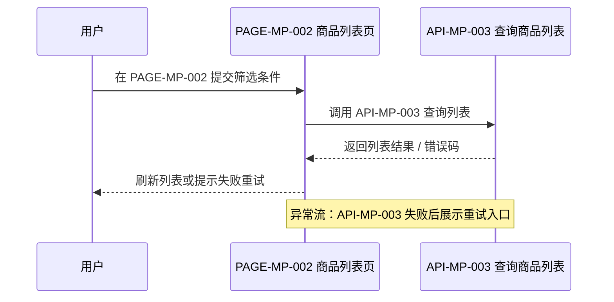

# LNY-PRD — 李宁远产品工作流

**工具包版本：2.8.28**

## 背景

跟 AI 写代码很快，但需求如果没写进机器，结果往往两个极端。

### 「能看不能用」

不会编程的人直接让 AI 出代码。模型容易瞎编：界面看起来有了，事却办不成。

### 「能用却看不懂、没法改」

会编程但不做产品的人，情况反过来。需求还在口头和脑子里，他们自己站在中间，一轮轮把「要什么」转述给 AI。代码也许能跑，可机器里没有一份大家都能读的规格——下次改什么、为什么是这样，只能再去问那个人。

## 制作初心

LNY-PRD 做的是 **vibe-spec-coding** 里的 **vibe-spec**：把已经想清楚的产品想法写成规格，再配一份能点的静态原型。规格进了机器，人就不必再当需求和 AI 之间的传话筒。你不必看懂代码，但要能看懂规格，才能对照、验收、改一版。交给研发，或接着做 **ai-coding**。**本包不写代码。**

## 基本原理

1. **先写规格，再画能点的图。** 只跟 AI 要一张原型，布局、数据和功能往往还留在聊天里，下一轮就对不齐。本包会先把这三件事写进规格，再出图。对人，你看到的仍是能点的页面；对研发和下一次 AI，依据是规格，不是那张网页。你说「先演示」时，Agent 也会在背后把规格补齐再出图，而不是只丢一份 HTML。

2. **先总、再分、再收束。** 先在根目录总规格（`*_spec`）里写整盘要做成什么样，再拆成页面、接口、功能三份明细（`ui/`、`api/`、`feature/`），最后收到每一页的说明和可点原型上。

3. **一条需求能从头讲到尾。** 用户要办成什么事 → 对应哪项功能 → 怎样算做成了 → 发生在哪一页 → 这一页要跟哪些接口说话。这条链连得上，人和 AI 才对得齐；断了就估不准，也做不准。

规格只写「产品要什么」，不写网址怎么拼、报文长什么样、数据库怎么建。本包不定产品方向，也不出可上线代码、设计稿、OpenAPI / DDL、人天排期。登录、支付、权限默认当作现成框架能力，不展开。

### 扩展阅读

不必先读完再开始用。想知道「为什么要这样」时，这三篇就够入门：

- [乔尔·斯波尔斯基《轻松写功能规格》](https://www.joelonsoftware.com/2000/10/02/painless-functional-specifications-part-1-why-bother/)（Painless Functional Specifications）：为什么要先有一份人能读的规格，而不是直接写代码。
- [芭芭拉·明托《金字塔原理》](https://en.wikipedia.org/wiki/The_Pyramid_Principle)：先说清楚整盘，再拆开写。本包的「先总、再分、再收束」就是这个结构。
- [需求可追溯性](https://en.wikipedia.org/wiki/Requirements_traceability)（Requirements traceability）：一条需求能从「用户要办成什么」一直追到页面和接口。

本仓库是 **技能包**，不是 PRD 项目。请另开空目录立项；**禁止在本仓库根目录执行 `/lny-prd-master`**。粒度对照见 [`examples/mini-shop/`](examples/mini-shop/)。

## 一、九步工作流

| 步骤 | 命令 | 职责 |
|------|------|------|
| ① | `/lny-prd-master` | 总控入口与立项，生成项目骨架（`main_spec.md` 等） |
| ② | `/lny-prd-ui` | 交互体验设计：`ui_manifest.md` + `ui/`（布局怎么好看、好用、丝滑；动效/微反馈/收纳） |
| ③ | `/lny-prd-api` | 接口需求（`api_spec.md` + `api/API-*.md`） |
| ④ | `/lny-prd-feature` | 功能规格拆分（`feature_spec.md` + `feature/FEATURE-*.md`） |
| ⑤ | `/lny-prd-page` | 单页 PRD 生成（`versions/{v}/pages_prd/`；PC/AD 必产 `_shell`） |
| ⑥ | `/lny-prd-prototype` | 高保真可交互原型（全端静态 HTML + MUI 套件；每轮最多 3 个业务页，逐页对照 `pages_prd`） |
| ⑦ | `/lny-prd-check` | 文档一致性检查 + 功能性验收 + 产品就绪度检查（只读报告） |
| ⑧ | `/lny-prd-iter` | 新迭代管理（建版本壳 + 变更台账 + 委派清单） |
| ⑨ | `/lny-prd-sp` | 按指定版本汇总 FE/BE 故事点（`sp_report.md`） |

**②③④** 为规格三件套，按 **②→③→④ 同轮批处理**（中间不问「继续」）。用户目标是原型/演示时，总控在**当前版本**静默补 ②③④⑤⑥，**禁止静默 ⑧**（只有明确说新迭代才建新版本）。⑥ **每轮最多 3 个业务页**；未画完时「继续」只续原型，不重做规格。

## 二、核心原则

- **目标驱动、规格先行**：对人要原型则先交付原型，缺口由 Agent 静默补规格；禁止用 HTML 代替规格，禁止静默开新版本
- **技能边界**：每一步都有明确的"负责"与"禁止"清单，Agent 不得越权；**Skill 只写干啥，原理说明书集中在本 README**
- **版本纪律**：仅 ① 可建 `v1.0.0`，仅 ⑧ 可建新版本并追加变更记录；小改留在当前版本
- **台账单值状态**：页面 `待② → 待⑤ → 已完成`；API `待③ → 已完成`；Feature `待④ → 已完成`。仅在本步成功落盘并自检后推进，禁止 `待②/待⑤` 复合值
- **只读检查**：⑦ `/lny-prd-check` 不改任何文件，仅输出报告与委派建议
- **框架内置排除**：`lny-default` 是作者栈的个性化配置，**不是**强制行业表（见 [`lny-prd-master/framework-exclusions.md`](lny-prd-master/framework-exclusions.md)）；立项须确认；换栈可设 `none`；未确认不得按默认表删需求

## 三、能力边界

### 3.1 本工具包能做什么（✅）

| 领域 | 说明 |
|------|------|
| **需求结构化** | 将模糊的产品想法转化为分层、有索引、可追溯的文档体系（主规格 → 页面 → 接口 → 功能） |
| **UI 规划** | 梳理页面清单、分包结构、组件层级，产出可落盘为 `ui/` 明细的 UI 设计规格 |
| **接口需求定义** | 按终端拆解 API 需求（含第三方），产出带请求/响应语义的接口明细文档 |
| **功能拆分** | 将整体需求拆为独立的功能模块，每个功能有目标、流程、验收标准 |
| **单页 PRD** | 面向具体页面的回归式需求文档，强制写明依赖路径与数据来源 |
| **可交互原型** | 全端静态 HTML + MUI 套件，**默认高保真**；触屏：TabBar 贴底无顶栏、胶囊避让、1:1 图、下沉 Banner、金刚区、左/底/右半屏；AD 含弹窗/签/下拉/日期；每轮最多 3 个业务页 |
| **文档检查** | 对已有 PRD 做只读一致性校验（引用闭环、编号规范、统计对齐），输出审计报告 |
| **迭代管理** | 创建新版本目录骨架、变更台账（ui/api/feature），标注委派清单 |
| **版本故事点** | 按版本汇总 FE/BE（及迭代系数）SP，落盘 `sp_report.md` |

**一句话**：从「已经想清楚要做什么」到「规格和原型齐了，交给 coding 环节」——只覆盖 vibe-spec，不覆盖实现。

### 3.2 本工具包不能做什么（❌）

| 领域 | 说明 |
|------|------|
| **不写生产代码** | 不生成后端 API 实现、数据库 DDL、业务逻辑、中间件配置等 |
| **不输出前端应用** | 原型是静态展示品，不是可上线的前端项目；没有路由、状态管理、接口联调等 |
| **不管理部署** | 不涉及 CI/CD、容器化、域名、服务器、发布流程 |
| **不写测试** | 验收标准是自然语言描述，不是可执行的自动化测试用例 |
| **不做技术选型** | 不定框架版本、不选数据库、不设计缓存策略——那是开发侧的事 |
| **不做项目管理** | 没有甘特图、人员排期；**⑨** 只给版本级故事点汇总，不做人天排期 |

**一句话**：产物停在 PRD + 静态原型；开发 Agent 读它来写代码，终端用户用不上它。

### 3.3 个人独立开发者须知：与编程技能包组合使用

如果你是**个人独立开发者**，想用 AI 从零到一上线，还需要 **coding** 环节的技能包。本包只做 vibe-spec-coding 里的 **vibe-spec**。

推荐组合方式：

| 阶段 | 使用的技能包 | 产出 |
|------|-------------|------|
| **产品规划** | `lny-prd-*`（本工具包） | PRD 文档 + 原型 |
| **技术实现** | Superpower、或其他 AI 编程指导类技能包 | 工程代码、前后端应用、部署配置 |
| **质量保障** | `lny-prd-check`（可交叉校验） + 代码审查类技能包 | 需求与实现的一致性核验 |

**典型流程**：

```text
lny-prd-*（立项 → 规格 → 原型）
        ↓  产物交付
Superpower 等编程技能包（需求理解 → 技术方案 → 逐模块编码 → 联调 → 上线）
        ↓  交叉校验
lny-prd-check（回归检查需求是否遗漏或偏离）
```

> Superpower 等技能包擅长根据需求描述（尤其是本工具包生成的 `main_spec`、`feature/`、`api/` 等结构化文档）快速生成技术方案和工程代码，补齐本工具包不覆盖的编码与部署环节。

```text
BE：main_spec 自上而下 + feature/api → Superpower（不以 pages_prd 为主入口）
FE：① ui 页壳 → ② api 全局层 → ③ 可复用 COMP → ④ 多 Agent 各读 pages_prd 装配
原型：默认 pages_prd；例外标注 ui直出
```

## 四、前置条件

- 支持 Agent Skills 的 AI 编程工具（Cursor、ChatGPT、TraeWork CN）
- 已按 5.1 将本仓库的 9 个 `lny-prd-*/` 技能作为整包安装
- 准备一个 **空的 PRD 项目目录**（不要用本技能包仓库根当项目根）

## 五、快速开始

### 5.1 安装

将本仓库克隆到本地。本仓库 = 技能包；PRD 项目 = 另开目录。安装器只使用 Python 标准库，不需要先安装 `requirements-dev.txt`。

9 个技能是一个原子、同版本的整包，禁止只安装或只更新其中一部分。仅支持用户级安装：

| 工具 | `--host` | 默认技能目录 |
|------|----------|--------------|
| Cursor | `cursor` | `~/.cursor/skills/` |
| ChatGPT | `chatgpt`（兼容别名 `codex`） | `~/.agents/skills/` |
| TraeWork CN | `traework-cn`（兼容 `trae-work`、`trae`、`trae-cn`） | `~/.trae-cn/skills/` |

> ChatGPT 当前按 OpenAI 官方 Agent Skills 约定使用 `~/.agents/skills/`。本机可能存在的 `~/.codex/skills/.system/` 是应用管理的内置技能目录，不是本整包的安装目标。

首次安装（把 `<host>` 换成表中的值）：

```bash
python scripts/install-skills.py install --host <host>
```

若目标中已有手工复制的同名技能，安装器会拒绝覆盖；确认需要接管时使用 `--force`，原目录会先备份。以后更新和检查状态：

```bash
python scripts/install-skills.py update --host <host>
python scripts/install-skills.py status --host <host>
```

本地修改过已安装副本时，更新会停止；确认丢弃这些修改时才对 `update` 加 `--force`。可先用 `--dry-run` 预览，卸载使用 `uninstall`。TraeWork CN 安装前须至少启动过一次；安装器会保留 `~/.trae-cn/skill-config.json` 中无关字段，并登记 9 个 `user_upload` 技能。

[`examples/`](examples/) 仅供人类查看，同时作为仓库 CI 回归数据；技能运行不依赖它，也不会把它复制进技能目录。需要仓库之外的独立副本时执行：

```bash
python scripts/install-skills.py export-examples
```

默认导出到 `~/.lny-prd/examples/`。对照粒度可查看 [`examples/mini-shop/`](examples/mini-shop/)（含 MP+AD、COMP-001、`_shell/AD-shell.md`、`sp_report.md`）。

### 5.2 使用

在 AI 编程工具中打开 **PRD 项目空目录**（或已有 `main_spec.md` 的目录），输入总控命令：

```
@lny-prd-master
```

或：

```
/lny-prd-master
```

Agent 将自动判定当前状态：

- **空目录**：进入立项对话；确认是否沿用 `框架排除 profile`（`lny-default` 为个性化配置，换栈用 `none`；未确认不得按默认表删需求）后生成初始文档
- **已有项目**：按状态检测路由；用户要原型则静默补 ②→⑥。回复「继续」= 重新走 §3（不是自动走完 ⑤⑥⑦）。⑧ 之后「继续」先清 ②③④，再 ⑤；⑥ 仅当当轮仍是演示/原型目标；规格齐了停在建议

### 5.3 推荐工作流

```text
① 立项 → ②③④ 规格三件套（同轮批处理） → ⑤ 单页 PRD → ⑥ 原型生成 → ⑦ 检查验收 → ⑨ 估点 → ⑧ 新迭代（仅用户明确要求）
```

「继续」= 重新走总控 §3，不是按上表自动走完。**②③④** 缺口会在同一轮连续完成。规格齐了只建议 ⑤⑥⑦，不自动落盘。当轮目标为演示时同一轮可做到 ⑥。要原型时对人静默补规格（禁止用 HTML 代替规格）；只有明确说新迭代才走 ⑧；⑦ 须明确要求检查。⑨ 估点落盘后同一轮只刷 `prototypes/index.html` 版本清单，不重画各端页面。估点见 [第八章](#八估点与可评估性)。

## 六、产物结构

完整的 PRD 项目生成后，目录结构如下：

```
my-project/                         # PRD 项目根目录
│
├── main_spec.md                    # 产品规格说明书（概述、终端、统计索引）
├── api_spec.md                     # 接口需求索引（§4 终端对齐 + API/EXT 清单）
├── ui_manifest.md                  # UI 设计清单（页面/分包/组件索引）
├── feature_spec.md                 # 功能规格索引（全局规则 + Feature 索引）
│
├── api/                            # 接口需求明细（③ 负责）
│   ├── API-MP-001.md               #   小程序接口
│   ├── API-AD-001.md               #   管理后台接口
│   └── EXT-001.md                  #   第三方接口
│
├── ui/                             # UI 页面与组件明细（② 负责）
│   ├── PAGE-MP-001.md              #   单页面布局与状态描述
│   ├── PAGE-AD-001.md
│   └── COMP-001.md                 #   局部自定义 UI 组件规格
│
├── feature/                        # 功能规格明细（④ 负责）
│   ├── FEATURE-001.md              #   单功能：目标、流程、验收标准、双图
│   └── FEATURE-002.md
│
├── prototypes/                     # 可交互原型（⑥ 负责）
│   ├── index.html                  #   总入口（简介 + 各端）
│   ├── MP/                         #   小程序端
│   │   ├── assets/                 #     从技能包 kit/ 拷贝的 MUI 视觉套件
│   │   ├── index.html              #     该端页面导航汇总
│   │   ├── map.html                #     页面关系图
│   │   └── PAGE-MP-001.html        #     单页原型
│   ├── AD/                         #   管理后台端（同样静态 HTML + kit）
│   └── PC/                         #   PC 端
│
└── versions/                       # 版本管理（① 立项 / ⑧ 迭代）
    ├── v1.0.0/                     #   首版
    │   ├── iteration_notes.md      #     过程性留痕
    │   ├── sp_report.md            #     版本故事点（⑨ 负责；夹具已给出）
    │   ├── pages_prd/              #     单页 PRD（⑤ 负责）
    │   │   └── PAGE-MP-001.md
    │   └── prototypes/             #     原型静态镜像
    └── v1.1.0/                     #   次版（⑧ 创建）
        ├── iteration_notes.md
        ├── eval_signals.md         #     迭代估点信号汇总（不计点）
        ├── sp_report.md            #     版本故事点（⑨ 负责）
        ├── ui_changes.md           #     变更台账
        ├── api_changes.md
        └── feature_changes.md
```

## 七、产物示例

以下摘取五种核心产物的典型片段，展示实际落盘格式。

#### 7.1 API 需求明细（`api/API-MP-001.md`）— 请求 & 响应参数字段表

##### 请求需求

| 业务字段 | 类型语义 | 必要 | 说明 |
|----------|----------|:--:|------|
| 商品名称 | 字符串 | 否 | 模糊搜索 |
| 分类 | 字符串（枚举） | 否 | 单选的枚举值；从分类下拉接口取值 |
| 价格区间 | 字符串 | 否 | "min,max" 格式，单位元 |
| 当前页码 | 数值 | 是 | 从 1 起 |
| 每页条数 | 数值 | 是 | 与列表页 UI 一致 |

##### 响应需求

| 业务字段 | 类型语义 | 必要 | 说明 |
|----------|----------|:--:|------|
| 商品列表 | 数组（元素为对象） | 是 | 每项含：商品 ID、名称、图片、价格、库存状态 |
| 总条数 | 数值 | 是 | 用于分页组件计算总页数 |

#### 7.2 UI 页面线框（`ui/PAGE-MP-001.md` / 单页 PRD 第 3 节）— ASCII 线框图

```text
┌────────────────────────────┐
│  顶栏：页面标题 + 返回按钮 │
├────────────────────────────┤
│  搜索区                    │
│  ┌──────────────────────┐  │
│  │ 搜索框 + 筛选按钮    │  │
│  └──────────────────────┘  │
├────────────────────────────┤
│  分类 Tab（全部 | 食品 |    │
│  日用品 | 数码）           │
├────────────────────────────┤
│  商品列表（瀑布流）        │
│  ┌──────┐ ┌──────┐        │
│  │ 卡片  │ │ 卡片  │  …   │
│  └──────┘ └──────┘        │
│  ┌──────┐ ┌──────┐        │
│  │ 卡片  │ │ 卡片  │  …   │
│  └──────┘ └──────┘        │
├────────────────────────────┤
│  底：分页 / 加载更多       │
└────────────────────────────┘
```

#### 7.3 Feature 功能时序图（`feature/FEATURE-001.md`）— Mermaid 泳道时序图


```mermaid
sequenceDiagram
    participant User as 用户
    participant UI_MP_002 as PAGE-MP-002 商品列表页
    participant API_MP_003 as API-MP-003 查询商品列表
    User->>UI_MP_002: 在 PAGE-MP-002 提交筛选条件
    UI_MP_002->>API_MP_003: 调用 API-MP-003 查询列表
    API_MP_003-->>UI_MP_002: 返回列表结果 / 错误码
    UI_MP_002-->>User: 刷新列表或提示失败重试
    Note over UI_MP_002,API_MP_003: 异常流：API-MP-003 失败后展示重试入口
```

#### 7.4 迭代台账（`versions/v1.1.0/ui_changes.md`）— 变更表与委派顺序

**变更台账**（`ui_changes.md`）：

| ID | 操作 | 变更形态 | 存量数据影响 | 摘要 | 委派步 | pages_prd目标路径 | 状态 |
|----|------|----------|--------------|------|--------|-------------------|------|
| PAGE-MP-004 | 新增 | 新建 | 无 | 商品详情页 | ② | versions/v1.1.0/pages_prd/pages/goods/PAGE-MP-004.md | 待② |
| PAGE-MP-001 | 修改 | 修改 | 无 | 首页新增推荐模块 | ② | versions/v1.1.0/pages_prd/pages/index/PAGE-MP-001.md | 待② |
| PAGE-MP-003 | 废弃 | 废弃删除 | 需备份或回滚预案 | 旧版搜索页下线 | ② | 无需单页 PRD | 待② |

**委派顺序**（`iteration_notes.md`）：

1. `/lny-prd-ui`（②）— 新增 PAGE-MP-004；修改 PAGE-MP-001；废弃 PAGE-MP-003
2. `/lny-prd-api`（③）— 新增 API-MP-010；修改 API-MP-002
3. `/lny-prd-feature`（④）— 新增 FEATURE-010；修改 FEATURE-003
4. `/lny-prd-page`（⑤）— `pages_prd/pages/goods/PAGE-MP-004.md`、`pages_prd/pages/index/PAGE-MP-001.md`
5. `/lny-prd-prototype`（⑥）— 有新增/修改页面，必做
6. `/lny-prd-check`（⑦）— 建议
7. `/lny-prd-sp`（⑨）— 本版本估点（可选）

#### 7.5 版本故事点

见 [第八章](#八估点与可评估性)、[`lny-prd-sp/reference-weights.md`](lny-prd-sp/reference-weights.md)，以及夹具 [`examples/mini-shop/versions/v1.0.0/sp_report.md`](examples/mini-shop/versions/v1.0.0/sp_report.md)。

## 八、估点与可评估性

> 各 `lny-prd-*/SKILL.md` **只**规定字段与禁项；本节说明估点信号落在哪、⑨ 怎么算。读完前面再看即可。

### 边界

| 项 | 约定 |
|----|------|
| 阶段 1 | 信号可采集 + check 可检查；**不算 SP** |
| 阶段 2 | **`/lny-prd-sp`** 按版本套公式打分 → `versions/{v}/sp_report.md` |
| PRD 永不写 | DDL、真实表名、HTTP/path/JSON/响应 code |
| 校准层 | FE 细视觉看设计稿；BE 表结构细活看实现/Superpower —— **均不进** FE 三维因子 / BE 四维枚举 |

### 产品可评估链（阻塞「不可估」）

`STORY → FEATURE → AC → PAGE → API`

缺任一关键环 → check **三、产品就绪度** 判不可估。FE/BE 信号缺 → 只标「角色估点信号不全」，**不**因此把产品打成不可估。

### FE 三维信号（落点）

> **FE 三维**（非 AD，一页一行）：① 页面定位 · ② 页面体验 · ③ 页面数据。与 BE 维号独立。角色基线：`主流程` 1.5 / `支线` 1.0 / `辅助`·`设置` 0.5。体验档：简单·粗糙 `0` / 标准 `0.5` / 较复杂·精致 `1` / 极复杂·极精致 `2`。功能数量：`0`/`1`/`2`/`3`；API 数量：`0`/`0.5`/`1.5`/`2`；编排：并行 `0` / 串行 `1.0` / 混合 `1.5`。

| 维 | 因子 | 手填/采集事实源 |
|:--:|------|------------------|
| ① 页面定位 | 角色基线 | 非 AD 的 PAGE + `pages_prd` §7 流程角色 |
| ① | 功能数量 | **单页** 关联 FEATURE 个数 → `少量`(0～2) / `一般`(3～5) / `较多`(6～8) / `极多`(≥9) |
| ② 页面体验 | 交互体验 | **单页** `ui/PAGE` + manifest：`简单` / `标准` / `较复杂` / `极复杂` |
| ② | 视觉细节 | **单页** `ui/PAGE` + manifest：`粗糙` / `标准` / `精致` / `极精致` |
| ③ 页面数据 | API数量 | **单页** `pages_prd` §5/§7 → `少量`(0) / `一般`(0.5) / `较多`(1.5) / `极多`(2) |
| ③ | 请求编排 | **单页** `pages_prd` §7：`单请求或并行` / `串行` / `串并行混合`（**门槛**：条数≤1→并行档；=2 禁混合；混合须≥3 且同路径兼串并行，见 page §7） |

### BE 四维信号（落点）

> **BE 维号独立于 FE**（①～④）。**不采持久化档**。  
> **① AD页面规模** = 仅 AD 页（骨架 + D5 + 本页 API 档，权重见 [`lny-prd-sp`](lny-prd-sp/SKILL.md)）。  
> **② 自有API** = 按 API 计行：API基线（服务对象）+ 数据操作形态 + 第三方联动 + 特殊通道。  
> **③ EXT对接**、**④ FEATURE规则** 各自独立。读写由形态覆盖；第三方「是」须挂 `EXT-*`；特殊通道覆盖 WebSocket/SSE 等。

| 维 | 名称 | 落盘 |
|:--:|------|------|
| ① | AD页面规模 | **按页**：`ui/PAGE` **骨架码** + **`D5弹窗数`**（清单一致）+ `pages_prd` **本页API条数**（§7=§5；0～4→+0；5～6→+0.5；7～9→+1.0；≥10→+1.5）；D5 档见 sp 权重 |
| ② | 自有API | 每条 `API-*`：服务对象；数据操作形态（含多对象普通/复杂）；第三方联动；特殊通道 |
| ③ | EXT对接 | **独立**：`EXT-*` + **交互方向** / **业务敏感度** / **联调门槛**（见 sp 权重） |
| ④ | FEATURE规则 | **独立**：FEATURE：**分支数** + AC 表行数 |

> **页数**：FE 按 **非 AD 页**估；BE ① = 仅 AD（页侧规模，非「页数×0.5」）。

表结构 ≈ 前端的设计稿：PRD 只采产品代理信号，细活实现后校准。

### 迭代估点信号（相对上一版）

首版能力信号不够估「改一版」的工时。迭代另采两列 + 一页汇总（**不计点**）：

| 信号 | 落盘 | 枚举 |
|------|------|------|
| **变更形态** | 三类 `*_changes.md` 每行 | `新建` / `复制扩展` / `修改` / `废弃删除` |
| **存量数据影响** | 同上 | `无` / `需迁移` / `需备份或回滚预案` |
| **汇总** | `versions/{v}/eval_signals.md` | 形态/存量计数 + 存量≠无关注列表 |

缺 → check 标「迭代估点信号不全」，不阻塞产品可估。禁止在清单写 DDL。

### 按版本故事点（`/lny-prd-sp`）

- **必指定版本**（或取 `versions/` 最大版本并写进报告抬头）。
- **计分范围**：无台账变更行 → **全量** active 规格；有台账 → **仅本版变更**并乘迭代系数。
- **产出**：`versions/{v}/sp_report.md`（FE_SP / BE_SP / 合计）；产品链不可估则停算；**同版本重跑直接覆盖**原报告。落盘后同一轮刷 `prototypes/index.html` 版本清单（⑥ 只刷总入口；无原型则跳过）。规格不齐时先问是否补完再估；否 → 只出不可估报告，仍刷总入口。
- **权重表**：以 [`lny-prd-sp/reference-weights.md`](lny-prd-sp/reference-weights.md) 为准（可后校准）。摘要：

| 侧 | 要点 |
|----|------|
| FE | **三维**（非 AD）：①页面定位（主流程 1.5；功能数量 0～3）· ②页面体验（0/0.5/1/2）· ③页面数据（API数量 0/0.5/1.5/2；编排 0/1/1.5） |
| BE | ①～④ 分对象：① AD页面规模 · ② 自有API（单侧基线 0.5 / 双侧 1）· ③ EXT对接（联调含「文档未知需研发调研」=5）· ④ FEATURE规则 |

| 迭代 | 形态：新建 1 / 复制扩展 0.4 / 修改 0.6 / 废弃 0.5；存量：无 1 / 迁移 1.3 / 备份回滚 1.2（连乘） |

样例直觉：主流程下单（高分支、多对象写入、可能含支付 EXT）≫ 独立反馈页（低分支、简单写入）。

对话回报只需 FE_SP / BE_SP / 合计三行。⑦ check 第三项（产品就绪度）含 FE/BE/迭代信号，**不计点**。

## 九、工具包结构

```
prdMaster/                          # 本仓库 = 技能包，禁止在此立项
├── lny-prd-master/
│   ├── SKILL.md                    # ① 总控与立项
│   ├── reference-init.md           # main_spec 模板
│   ├── reference-page-types.md     # ②⑤⑥ 共用页型职责与金样映射
│   └── framework-exclusions.md     # lny-default / none
├── lny-prd-ui/
│   ├── SKILL.md                    # ②
│   ├── reference.md
│   └── scripts/migrate-prd-structure.mjs
├── lny-prd-api/SKILL.md + reference.md
├── lny-prd-feature/SKILL.md + reference.md
├── lny-prd-page/SKILL.md + reference.md
├── lny-prd-prototype/
│   ├── SKILL.md                    # ⑥ 全端静态 HTML + kit
│   ├── reference-kit.md            #     MUI 视觉类名与壳数据
│   ├── reference-icons.md          #     闭集 + search-icons.py
│   ├── reference-shell.md
│   ├── reference-quality.md
│   ├── gold/                       #     视觉金样（列表/表单/详情 + 分栏/定位/状态导览/树嵌套/工作台等）
│   ├── kit/                        #     mui-kit.css / proto-shell.* / proto-map.js / md-icons.js
│   └── scripts/                    #     copy-kit.py、search-icons.py、verify-prototype-utf8.py、verify-prototype-coverage.py
├── lny-prd-check/SKILL.md + reference-checks.md
├── lny-prd-iter/SKILL.md + reference.md
├── lny-prd-sp/SKILL.md + reference-weights.md
├── examples/mini-shop/             # 人类只读样例 + CI 回归数据（不参与安装）
├── skill-bundle.json               # 整包 ID、版本、9 技能全集与可选资源
├── scripts/install-skills.py       # 三平台用户级整包安装、更新、状态与卸载
├── scripts/test_install_skills.py  # 安装事务、回滚、漂移与平台配置测试
├── scripts/validate-skill-package.py # 元数据、清单、链接、脚本、kit、金样与回归总门禁
├── requirements-dev.txt            # 本地与 CI 的 PyYAML 发布门禁依赖
├── .github/workflows/validate-skills.yml
├── README.md
└── LICENSE
```

`lny-prd-ui` 另含 `reference-mobile-design.md` 与 `reference-desktop-design.md`（桌面通栏/分栏/表单栅格/列表六型/状态导览/定位与树）。
## 十、维护回归

首次本地使用时，在仓库根创建持久虚拟环境并安装依赖（只需执行一次）：

```powershell
# Windows
python -m venv .venv
.\.venv\Scripts\python -m pip install -r requirements-dev.txt
```

```bash
# macOS / Linux
python3 -m venv .venv
./.venv/bin/python -m pip install -r requirements-dev.txt
```

以后修改技能、金样、套件或示例后，直接复用该环境运行：

```powershell
# Windows
.\.venv\Scripts\python scripts\validate-skill-package.py
```

```bash
# macOS / Linux
./.venv/bin/python scripts/validate-skill-package.py
```

`.venv/` 仅保留在本机并由 Git 忽略；除非 `requirements-dev.txt` 发生变化，无需重复安装。GitHub Actions 使用全新环境，仍会在每次任务中安装依赖。

门禁使用真实 YAML 解析并逐一 quick-validate 9 个技能，同时检查 `skill-bundle.json` 与 README 版本一致、技能运行时不依赖 `examples/`、`agents/openai.yaml`、Markdown 链接、全量文本 UTF-8、Python/JavaScript 语法、安装事务与回滚、迁移冲突保护、kit 与副本、全部金样、页面 ID、根原型与版本镜像完全一致，以及带正反例的 12 页 coverage。GitHub Actions 在 push 和 pull request 时运行同一脚本；任一项失败均不得发布。元数据路由固定为：总控 `allow_implicit_invocation: true`，其余子技能为 `false`，子技能仍可通过 `$lny-prd-*` 显式调用。

## 十一、许可证

MIT License
