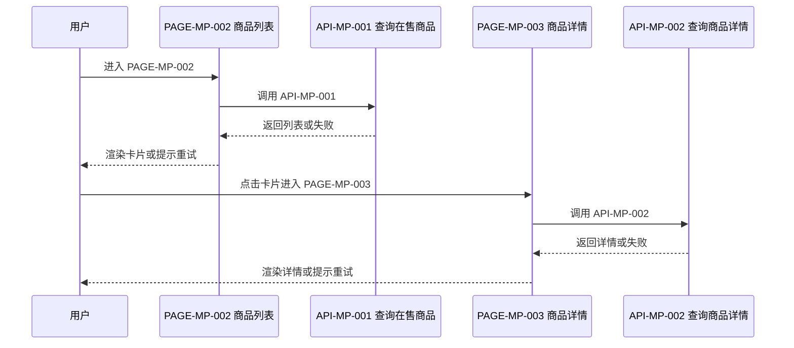
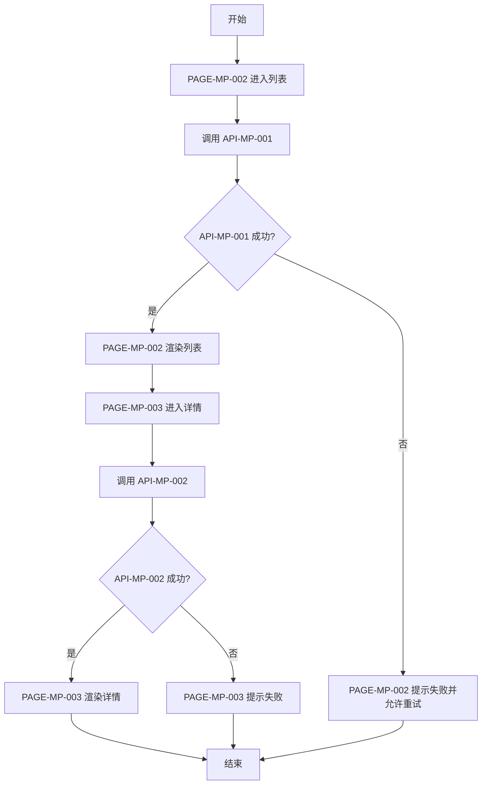

# FEATURE-001 浏览在售商品

## 1. 基本信息
| 属性 | 内容 |
|------|------|
| 功能编号 | FEATURE-001 |
| 功能名称 | 浏览在售商品 |
| 模块编号 | MODULE-001 |
| 所属模块 | 商品 |
| 优先级 | P0 |
| 状态 | active |
| 评审状态 | approved |
| 关联 STORY | STORY-001 |
| 分支数 | 3 |

## 2. 功能目标与范围
- 目标：买家浏览推荐、列表与详情；运营在后台核对商品
- 范围内：分页查询、搜索筛选、详情展示（含图文介绍与评论）、失败重试
- 范围外：下单、支付、登录（框架承接）

## 3. 核心规则
| 规则编号 | 规则说明 |
|----------|----------|
| BR-1 | 小程序列表与详情仅展示在售商品 |
| BR-2 | 请求失败须提供重试入口 |

## 4. 交互与状态（概要）
- 正常流：进页请求列表或详情并渲染
- 异常流：失败提示并允许重试
- 边界条件：空列表展示空态

## 5. 验收标准
| AC 编号 | 验收描述（可验证） | 关联规则 | 关联页面 | 关联接口 | 验证方式 |
|---------|-------------------|----------|----------|----------|----------|
| AC-1 | 首页初始化后展示不超过 4 条推荐商品 | BR-1 | PAGE-MP-001 | API-MP-001 | UI + API 联调 |
| AC-2 | 商品列表可搜索、筛选、翻页且仅含在售商品 | BR-1 | PAGE-MP-002 | API-MP-001 | UI + API 联调 |
| AC-3 | 后台列表可按名称筛选并分页 | — | PAGE-AD-001 | API-AD-001 | UI + API 联调 |
| AC-4 | 小程序请求失败出现重试入口 | BR-2 | PAGE-MP-001, PAGE-MP-002 | API-MP-001 | 异常流测试 |
| AC-5 | 从列表进入详情可见名称、售价、库存、图文介绍与评论 | BR-1 | PAGE-MP-003 | API-MP-002 | UI + API 联调 |
| AC-6 | 后台整页详情可见名称、售价、库存、图文介绍与评论 | BR-1 | PAGE-AD-008 | API-AD-002 | UI + API 联调 |

## 6. 关联对象
- 关联页面：PAGE-MP-001, PAGE-MP-002, PAGE-MP-003, PAGE-AD-001, PAGE-AD-008
- 关联接口：API-MP-001, API-MP-002, API-AD-001, API-AD-002
- 关联第三方接口：无
- 引用文档：ui/PAGE-MP-001.md, ui/PAGE-MP-002.md, ui/PAGE-MP-003.md, ui/PAGE-AD-001.md, ui/PAGE-AD-008.md, api/API-MP-001.md, api/API-MP-002.md, api/API-AD-001.md, api/API-AD-002.md

## 7. 时序图（按触发条件必填）

## 8. 流程图（按触发条件必填）

## 9. 变更备注（可选）
- 夹具首版；补详情展示
