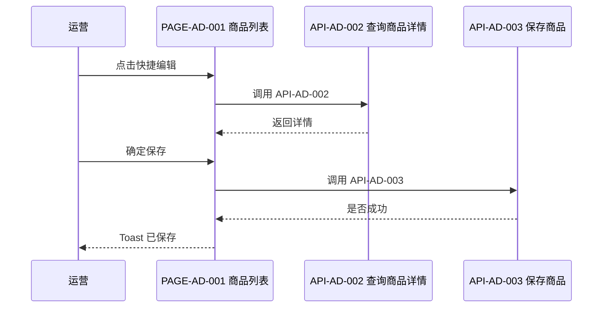
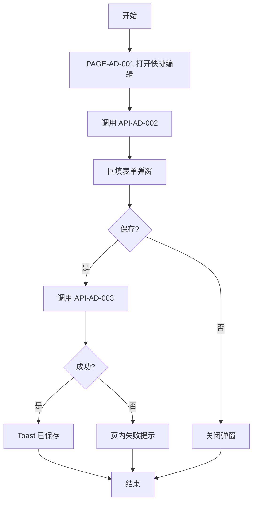

# FEATURE-002 维护后台商品

## 1. 基本信息
| 属性 | 内容 |
|------|------|
| 功能编号 | FEATURE-002 |
| 功能名称 | 维护后台商品 |
| 模块编号 | MODULE-001 |
| 所属模块 | 商品 |
| 优先级 | P0 |
| 状态 | active |
| 评审状态 | approved |
| 关联 STORY | STORY-002 |
| 分支数 | 3 |

## 2. 功能目标与范围
- 目标：运营在后台查看详情、快捷改价态、或打开整页表单新增/编辑
- 范围内：展示弹窗、表单弹窗、列表弹窗选关联、整页表单、日期与下拉、开关/单选/多选
- 范围外：删除、批量导入、登录（框架承接）

## 3. 核心规则
| 规则编号 | 规则说明 |
|----------|----------|
| BR-1 | 查看只读；快捷编辑与整页表单可写 |
| BR-2 | 名称、售价必填，否则不可保存 |
| BR-3 | 选择关联只回填提示，不改主列表行 |

## 4. 交互与状态（概要）
- 正常流：列表操作打开对应弹窗或进入表单页并保存
- 异常流：校验失败页内提示；详情失败 Toast
- 边界条件：列表弹窗可勾选一条关联商品

## 5. 验收标准
| AC 编号 | 验收描述（可验证） | 关联规则 | 关联页面 | 关联接口 | 验证方式 |
|---------|-------------------|----------|----------|----------|----------|
| AC-1 | 「查看」打开只读详情弹窗 | BR-1 | PAGE-AD-001 | API-AD-002 | UI + API 联调 |
| AC-2 | 「快捷编辑」可改库存状态与上架日期并保存 | BR-1, BR-2 | PAGE-AD-001 | API-AD-002, API-AD-003 | UI + API + 数据校验 |
| AC-3 | 「新增」进入整页表单，保存后回列表 | BR-2 | PAGE-AD-002 | API-AD-003 | UI + API + 数据校验 |
| AC-4 | 「选择关联」打开列表弹窗并确认一条 | BR-3 | PAGE-AD-001 | API-AD-001 | UI 交互测试 |

## 6. 关联对象
- 关联页面：PAGE-AD-001, PAGE-AD-002
- 关联接口：API-AD-001, API-AD-002, API-AD-003
- 关联第三方接口：无
- 引用文档：ui/PAGE-AD-001.md, ui/PAGE-AD-002.md, api/API-AD-001.md, api/API-AD-002.md, api/API-AD-003.md

## 7. 时序图（按触发条件必填）

## 8. 流程图（按触发条件必填）

## 9. 变更备注（可选）
- 夹具补后台维护示例
