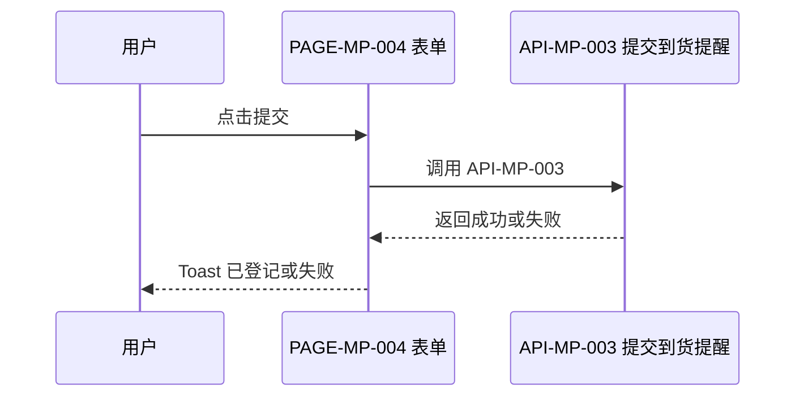
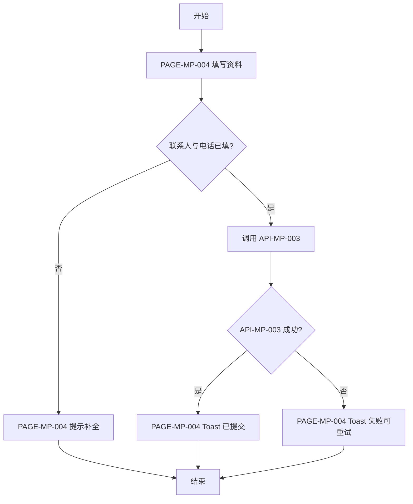

# FEATURE-003 登记到货提醒

## 1. 基本信息
| 属性 | 内容 |
|------|------|
| 功能编号 | FEATURE-003 |
| 功能名称 | 登记到货提醒 |
| 模块编号 | MODULE-001 |
| 所属模块 | 商品 |
| 优先级 | P1 |
| 状态 | active |
| 评审状态 | approved |
| 关联 STORY | STORY-003 |
| 分支数 | 1 |

## 2. 功能目标与范围
- 目标：买家在详情后登记联系方式，商品到货时被通知
- 范围内：填写并提交到货提醒（含优先级、溢价、规格、日期、地区与上传）
- 范围外：下单、支付、登录（框架承接）

## 3. 核心规则
| 规则编号 | 规则说明 |
|----------|----------|
| BR-1 | 联系人、联系电话必填才可提交 |
| BR-2 | 提交失败须允许重试 |

## 4. 交互与状态（概要）
- 正常流：从详情进入表单，填写后提交并 Toast 成功
- 异常流：缺必填或失败 Toast
- 边界条件：取消直接回详情，不二次确认

## 5. 验收标准
| AC 编号 | 验收描述（可验证） | 关联规则 | 关联页面 | 关联接口 | 验证方式 |
|---------|-------------------|----------|----------|----------|----------|
| AC-1 | 未填联系人或电话时不可成功提交 | BR-1 | PAGE-MP-004 | 无 | UI 表单校验 |
| AC-2 | 填写完整后提交出现已登记反馈 | BR-1 | PAGE-MP-004 | API-MP-003 | UI + API + 数据校验 |
| AC-3 | 提交失败可再次提交 | BR-2 | PAGE-MP-004 | API-MP-003 | 异常流测试 |

## 6. 关联对象
- 关联页面：PAGE-MP-004 表单（夹具为套件样例，提交仅 Toast）
- 关联接口：API-MP-003
- 关联第三方接口：无
- 引用文档：ui/PAGE-MP-004.md, api/API-MP-003.md

## 7. 时序图（按触发条件必填）

## 8. 流程图（按触发条件必填）

## 9. 变更备注（可选）
- 夹具补触屏表单页
